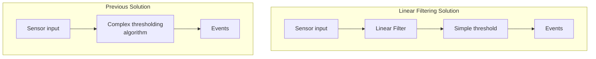

In this section, we look at frequency based linear filtering, a mathematical approach which is used to clean up continous numerical sensor data, i.e. data from sensors which report a range of values, such as our sound and light sensors.

Filtering can be used to clean up data where our desired output is also a continous numerical value, but it can also provide a really useful way to clean up the continuous inputs we use in our thresholding and event detection. In fact, with careful application of linear filters, it is often possible to skip many of the methods used in our previous section on robust event detection, and just apply linear filtering to clean up the data and follow it by a very simple threshold.

<figure markdown=1>

<figcaption>Linear filtering can support or replace complex thresholding algorithms</figcaption>
</figure>

# Key concept: signal frequency

To understand linear filtering, we need to understand a really key concept, that of frequency in signals. So, sensor signals as we typically see them are *time-domain* signals. This means that we have a value for the signal at a series of known points in time. Another way of representing signals is in the *frequency domain*. You may have seen frequency based representations of audio signals; check out Figure 2 to see one. 

<figure markdown=1>
Click here to play the audio file, and look at the visual representations of it below:
<audio controls>
<source src="{{'/images/twinkle.mp3'|relative_url}}"></source>
</audio>
<table>
<tr>
<td>

</td>
<td>

</td>
</tr>
</table>
<figcaption>The time-domain waveform (left) makes it clear when audio is loud or quiet, but in the frequency domain representation (right), the pitches of the audio file can also be seen.
</figcaption>
</figure>

If you look at the frequency domain *spectrogram* of the audio file above, you can see that different frequencies in the graph have different meanings, in this case higher parts of the graph refer to higher pitches in the audio file. In the case that multiple pitches are sounding at the same time, we would see multiple pitches on the graph at once, whereas in the time-domain data, we would just see the vibrations pertaining to each pitch overlaid, and the fact of the multiple pitches would be lost. Thus in the time domain, it is hard to understand what is happening with multiple overlaid pitches, whereas in the frequency domain it becomes clear.

Understanding sensor data in terms of frequencies can similarly allow us to understand multiple overlaid physical processes which are all affecting the single value presented by the sensor. 

For example, with the light sensor, the single value we are given can be affected by:
* The time of day (i.e. is it before or after sunset and how high is the sun in the sky )
* The phase and rising of the moon (if it is night time)
* Clouds passing in front of the sun
* Whether the light is turned on or off in the room
* Whether a person is moving around near to the sensor
* Random noise in the sensor circuitry

All these things typically fluctuate at different rates; random noise often changes very quickly, people moving around near the sensor lead to quite quick changes, the light turning on and off leads to immediate step changes, which then alter the ambient light level for long periods of time, and time of day or moon phase change only very slowly. If we consider these in terms of frequencies, we can plot them in order of high to low frequency as can be seen in figure 3:

<figure markdown=1>
<table>
    <tr>
        <th>Frequency</th>
        <th>Timescale</th>
        <th>Elements of signal</th>
    </tr>
    <tr>
        <td>Low</td>
        <td>28 days</td>
        <td>Moon phase</td>
    </tr>
    <tr>
        <td rowspan="3" class="arrowdowncell">
        </td>
        <td>24 hours</td>
        <td>Sunrise state</td>
    </tr>
    <tr>
        <td>Hours, minutes</td>
        <td>Current room artificial light setting, changes in cloud cover</td>
    </tr>
    <tr>
        <td>Seconds</td>
        <td>People moving round or changes in light settings</td>
    </tr>
    <tr>
        <td>High</td>
        <td>Sub seconds</td>
        <td>Random noise</td>
    </tr>

</table>
<figcaption>The signal from a light sensor is affected by a range of different things, which affect the output signal at different frequencies.</figcaption>
</figure>

# Isolating desired frequencies

When we are doing sensor processing, we often want only to know about certain parts of the signal. Figure <span class="nextfig"/> shows an example of a whole day's light sensor data from inside a room with a window to the outside. We can see that at 6:00 someone turns on a light, which makes the room bright, as the daylight gets brighter, the light is turned off, and the light level responds to the sunlight coming in, until 16:00 when the light is turned on again, until 21:00 when the room falls dark. We can also see a number of moments when a person walks past the light sensor, causing a momentary dip in light level. The signal is also affected by a small quantity of random noise. 




So, looking at this dataset, we can consider a range of possible uses for this sensor data. Lets look at two in detail:

1. Firstly, we could use this sensor data to estimate the ambient light level over the day, i.e. the level of light which is falling on the sensor coming from either the room light or from outside. To do this we need to get rid of random noise and also the fluctuations as people walk past the sensor. To do this, we would want to remove the high frequencies from the signal, and focus on the low and mid frequencies.

2. We might also be interested in tracking human behaviour in the room through detecting the events, the sharp, brief dips in light level. To be able to do this easily, we want to ignore the effect of low frequencies in the signal, removing the effect of ambient light, and just tracking the little spikes.

There are a range of ad-hoc ways we could solve these problems, such as by using adaptive thresholds to detect spike events, or simply averaging data over a long time to get the ambient light level. However, a more principled way of doing this is to use a linear filter to do this.

In this course, we will primarily talk about two types of linear filter - **high-pass** and **low-pass** filters. *High-pass* filters take a signal, and return the signal with the low frequency, slow variations in level removed. Low-pass filters do the opposite, they return only the slow variations, while supressing the quick high frequency changes in the signal. So, to accomplish task 1 above, we would probably want to use a low-pass filter to remove noise and brief spikes, whereas with task 2, we are only interested in short term variation, so we could use a high-pass filter to suppress the slow variations caused by the ambient light level changing.

# Task 1 - Low-pass filtering to estimate ambient light or sound level

A low-pass filter takes a signal and reduces the level of the high frequencies in that signal. Design of low-pass filters can involve complex maths to make the optimum filter for a particular purpose. Filter design is beyond the scope of this course. For this course, we will only really talk about the most simple low-pass filter, the **first order low-pass filter**. This essentially applies a very simple smoothing algorithm to the signal which has the effect of attenuating the high frequencies whilst retaining low frequency fluctuations.

## First order low-pass filter definition

The first order low-pass filter is defined by the equation below, where $$Y_T$$ is the filter output at time T, and $$X_T$$ is the input signal to the filter. $$\alpha$$(Alpha) is the smoothing factor - as $$\alpha$$ becomes lower, the output of the filter at each time step becomes more stable; if $$\alpha$$ is equal to 1, the filter will always output the initial value. As $$\alpha$$ is set closer to zero, more of the high frequency content remains in the output signal, until at $$\alpha=0$$ the filter outputs a completely unmodified input signal.

$$
Y_T =  \alpha * X_T + (1-\alpha)* Y_{T-1}
$$

As well as considering $$\alpha$$ intuitively as a smoothing factor, we can consider it's relation to two things - the *cutoff frequency* of the filter and its *time constant*. A low-pass filter is designed to keep (or *pass*) information in the signal below the *cutoff frequency*, whilst reducing the input of frequencies above the cutoff frequency. This simple filter does this just by smoothing out changes in the signal over time, which brings us to the *time constant*; the time constant is defined as the time taken for a rising edge input from 0 to 1 to cause a rise in filter output to 0.63. If the time constant is higher, the filter has a slower and more smooth response to changes in signal. Cutoff frequency and time constant both map directly to alpha, using the equations below, where $$\Delta_T$$ is the time between samples (in seconds), and $$\alpha$$ is the coefficient in the algorithm. For slightly historical reasons relating to analog electronic implementations of low-pass filters the time constant is usally referred to as $$RC$$. In code, we will need to know $$\alpha$$. If we wish to define our filter response in terms of cutoff frequency of time constant, we can do this using the equations in Figure <span class="nextfig"> below.


<figure>
<table>
<tr>
<th> $$\alpha \text{ from parameter}$$</th>
<th>$$\text{Parameter from }\alpha$$</th>
</tr>
<tr>
<td width="50%">
$$
\alpha = \frac{\Delta_T}{RC+\Delta_T}
$$
</td>
<td width="50%">
$$ 
RC = \Delta_T (\frac{1-\alpha}{\alpha})
$$
</td>
</tr>
<tr>
<td>
$$
\alpha = \frac{f_{cutoff}2\pi\Delta_T }{f_{cutoff}2\pi\Delta_T+1}
$$
</td>
<td>
$$
f_{cutoff} = \frac{\alpha}{(1-\alpha)2\pi\Delta_T} 
$$
</td>
</tr>
</table>
<figcaption>These equations allow us to calculate alpha (which we will want in code) from either the time constant or cutoff frequency, which give meaningful units to our low-pass filter coefficients</figcaption>
</figure>

# Low-pass filter in code

In code, the first order lowpass filter is as simple as: 

```python
filter_out = alpha * sensor_value + (1-alpha)*filter_out
```

In the example code, we will wrap our low-pass filter in a little filter class. This basically just stores the filter output value from the previous sample. The reason for encapsulating this in a class is because if you are using multiple sensor values and you want to filter more than one of them, you need to store the output value independently for each filtered sensor. If you use a class, you can just bung in another instance of the class and you are cool, without having to keep track of a load of filter variables.

The basic filtering class looks like this. In the working code below you will see there are comments and some helper functions to allow you to make filters based on time constant or cutoff frequency, but the basic workings of the filter are as simple as the short class below. Incidentally, I include these filters in the 'filters' module, so you can do `import filters` and you will have them in your code.

```python
class LowPassFilter:
  def __init__(self,alpha):
    self.last_value=0

  def on_value(self,value_in):
    self.last_value=self.alpha * value_in +(1-self.alpha)*self.last_value
    return self.last_value
```

So, here we go, lets write something to apply a low-pass filter to a sensor. Here we make a low-pass filter class, and then apply it with a time constant of 5 seconds to a sound sensor. This allows us to have a good idea of the general level of sound in a room right now, whilst not jumping around loads because of e.g. people talking or single loud noises. We might further want to know about lower frequencies in the signal, such as when answering the question 'how loud was this room in the last hour'. We could do this just by changing the time constant to be larger.

I've added documentation strings and a couple of helper functions to our low-pass class. About docstrings, if you don't know about them yet, you really should learn - they make it easy to automatically extract documentation from python code, and they make it so that if you're at a python console and you type help(function), or help(module), you get a useful help message. You can read more about them in the [python standard PEP257](https://www.python.org/dev/peps/pep-0257/) which specifies how to use them.


<script>
makePyodideBox({
    codeString:`
# 5 second time constant for the filter
# try playing with making this smaller or bigger
FILTER_TIME_CONSTANT=5 

import time
import graphs
import sensors
from math import pi 
# we use pi for calculation
# of alpha from cutoff frequency
class LowPassFilter:
    '''
    A class to perform simple first order 
    lowpass filtering on a sensor value

    Methods
    -------
    on_value(value_in)
        Process a new value with the filter and return the old one
    '''
    def __init__(self,alpha):
        self.last_value=None
        self.alpha=alpha


    def on_value(self,value_in):
        # if we haven't seen any value yet,
        # set this as our filter output        
        if self.last_value==None:
            self.last_value=value_in
        # this is the actual filter calculation
        self.last_value=self.alpha * value_in + (1-self.alpha)*self.last_value
        return self.last_value

    # a couple of handy static methods to create
    # filters based on time constant or cutoff frequency
    def make_from_cutoff(cutoff_frequency,time_between_samples):
        ''' Make a low-pass filter with this cutoff frequency .
                Parameters:
                    cutoff_frequency: Cutoff frequency in HZ
                    time_between_samples: seconds between samples

                Returns:
                    filter(LowPassFilter): 
                        Low-pass filter object
        '''
        fc=cutoff_frequency*time_between_samples*2*pi
        alpha=fc/(fc+1)
        return LowPassFilter(alpha)

    def make_from_time_constant(time_constant,time_between_samples):
        ''' Make a low-pass filter with a particular time constant.
                Parameters:
                    time_constant: Time constant in seconds
                    time_between_samples: Seconds between samples

                Returns:
                    filter(LowPassFilter): Low-pass filter object
        '''
        alpha=(time_between_samples)/(time_constant+time_between_samples)
        return LowPassFilter(alpha)

graphs.set_style("sound","rgb(0,0,0)",0,1)
graphs.set_style("lowpassed sound","rgb(255,0,0)",0,1,subgraph_y=1)

soundFilter=LowPassFilter.make_from_time_constant(FILTER_TIME_CONSTANT,0.05)
while True:
    sound_level=sensors.sound.get_level()
    sound_lowpassed=soundFilter.on_value(sound_level)
    print(sound_level,sound_lowpassed,sep=',')
    graphs.on_value("sound",sound_level)
    graphs.on_value("lowpassed sound",sound_lowpassed)
    time.sleep(0.05)
`  ,hasConsole:true,hasGraph:true,showCode:true,editable:true,caption:"Light sensor event detection using simple threshold"})
</script>

## What bad things does a low-pass filter do to my filter?
A low-pass filter by definition removes high-frequency variations from the signal. However, it is important to understand that this is not without any problems. A key problem with low-pass filters is how they cause delay in response. This can make systems that use excessive low-pass filtering respond to events with a delay. Check out the example below which uses light sensor to detect if the light is on or off. If you make the time constant of the filter shorter, you'll see that the system responds quicker, but is also sensitive to things like if you wave in front of the sensor, whereas if the you make the time constant longer, the system is more robust, but takes a longer time to notice that the switch has changed.

<script>
makePyodideBox({
    codeString:`# two second time constant - mess with this to see 
# the response changing
FILTER_TIME_CONSTANT=2
import graphs, sensors,time
# The filters module contains my simple high and low pass filters
import filters
graphs.set_style("light","rgb(0,0,0)",0,1)
graphs.set_style("lowpassed light","rgb(255,0,0)",0,1,subgraph_y=1)
graphs.set_style("light is on","rgb(255,0,0)",0,1,subgraph_y=2)

lightFilter=filters.LowPassFilter.make_from_time_constant(FILTER_TIME_CONSTANT,0.05)
while True:
    light_level=sensors.light.get_level()
    light_lowpassed=lightFilter.on_value(light_level)
    graphs.on_value("light",light_level)
    graphs.on_value("lowpassed light",light_lowpassed)
    graphs.on_value("light is on",light_lowpassed>0.5)
    time.sleep(0.05)
`  ,hasConsole:true,hasGraph:true,showCode:true,editable:true,caption:"Low-pass filter causes delay - try 'turning on and off the light' by covering the light sensor and see how long this takes to detect the changes in light status."})
</script>

# Task 2 - High-pass filtering to emphasise short term changes in value

A *high-pass* filter does the opposite of a low-pass filter. Instead of suppressing the high frequencies of a signal, a high-pass filter attenuates the low frequencies in a signal, to leave only the higher frequencies. This can be useful for example if we want to remove extremely slow variations in a light sensor signal caused by changes in ambient light, and only see short term variation when a person does something which immediately changes the level of light hitting the sensor. 

We will introduce here a simple first-order high-pass filter. This is very similar to the first-order low-pass filter we saw above. In fact, it can be derived from that filter directly as it is mathematically equal to first applying a low-pass filter to the input data, then subtracting that low pass value from the original sensor data. The formula for this filter is shown below:

$$
Y_T = \alpha * Y_{T-1} + \alpha * (X_T-X_{T-1})
$$ 

which simplifies to:

$$
Y_T = \alpha * ( Y_{T-1} + X_T-X_{T-1})
$$

The value from a high-pass filter jumps when the input value changes, then slowly decays back towards zero. This means that even if you are filtering a purely positive value, you can expect the output to go negative when the input moves from a high value to a low one. As such, high pass filters primarily show changes in the signal and lose information about the absolute value of the input signal. The figure below shows how the value of alpha relates to high-pass filter cutoff frequency and time constant. The cutoff frequency is the frequency below which we aim to remove information from the signal. The time constant for high-pass filter is defined as the time it takes for the output to decay back to roughly 0.37 when the input value changes from 0 to 1 (ask me if you really want to know why these numbers are what they are). 

<figure>
<table>
<tr>
<th> $$\alpha \text{ from parameter}$$</th>
<th>$$\text{Parameter from }\alpha$$</th>
</tr>
<tr>
<td width="50%">
$$
\alpha = \frac{RC}{RC+\Delta_T}
$$
</td>
<td width="50%">
$$ 
RC = \Delta_T (\frac{\alpha}{1-\alpha})
$$
</td>
</tr>
<tr>
<td>
$$
\alpha = \frac{1 }{f_{cutoff}2\pi\Delta_T+1}
$$
</td>
<td>
$$
f_{cutoff} = \frac{1-\alpha}{2\pi\alpha\Delta_T} 
$$
</td>
</tr>
</table>
<figcaption>These equations allow us to calculate alpha (which we will want in code) from either the time constant or cutoff frequency, which give meaningful units to our high-pass coefficients</figcaption>
</figure>

# High-pass filter Python implementation

Just like the low-pass, the first order high-pass filter translates to simple python code.

```python
high_passed = alpha * (last_highpass + this_input - last_input)
```
We'll stick a little class around it again, this time the class needs to store the previous input value and the previous output value.

```python
class HighPassFilter:
  def __init__(self,alpha):
    self.last_output=0
    self.last_input=0

  def on_value(self,value_in):
    self.last_output=self.alpha * (self.last_output + value_in - self.last_input )
    self.last_input=value_in
    return self.last_output
```

And here is some code which uses the light sensor. If you look at the unfiltered graph, you can see that it shows the ambient light level. If you then move to somewhere else so that a different level of light is hitting the sensor, or close a curtain or something, this light level changes. However, whatever the ambient light level is, the high-pass filtered output should stabilise to zero, only showing any non-zero output when any sudden change in light level happens (like if you put your finger over the camera).

<script>
makePyodideBox({
    codeString:`
# 2 second time constant for the filter
# try playing with making this smaller or bigger
FILTER_TIME_CONSTANT=2 

import time
import graphs
import sensors
from math import pi 
# we use pi for calculation
# of alpha from cutoff frequency
class HighPassFilter:
    '''
    A class to perform simple first order 
    high pass filtering on a sensor value

    Methods
    -------
    on_value(value_in)
        Process a new value with the filter and return the old one
    '''
    def __init__(self,alpha):
        self.last_input=None
        self.last_output=None
        self.alpha=alpha

    def on_value(self,value_in):
        # if we haven't seen any value yet,
        # set this as our filter output        
        if self.last_input==None:
            self.last_input=value_in
            self.last_output=0
        # this is the actual filter calculation
        self.last_output=self.alpha * (self.last_output + value_in - self.last_input)
        self.last_input=value_in
        return self.last_output

    # a couple of handy static methods to create
    # filters based on time constant or cutoff frequency
    def make_from_cutoff(cutoff_frequency,time_between_samples):
        ''' Make a high-pass filter with this cutoff frequency .
                Parameters:
                    cutoff_frequency: Cutoff frequency in HZ
                    time_between_samples: seconds between samples

                Returns:
                    filter(HighPassFilter): 
                        High-pass filter object
        '''
        fc=cutoff_frequency*time_between_samples*2*pi
        alpha=1/(fc+1)
        return HighPassFilter(alpha)

    def make_from_time_constant(time_constant,time_between_samples):
        ''' Make a high-pass filter with a particular time constant.
                Parameters:
                    time_constant: Time constant in seconds
                    time_between_samples: Seconds between samples

                Returns:
                    filter(HighPassFilter): 
                        High-pass filter object
        '''
        alpha=(time_constant)/(time_constant+time_between_samples)
        return HighPassFilter(alpha)

graphs.set_style("light","rgb(0,0,0)",0,1)
graphs.set_style("highpassed light","rgb(255,0,0)",-1,1,subgraph_y=1)

lightFilter=HighPassFilter.make_from_time_constant(FILTER_TIME_CONSTANT,0.05)
while True:
    light_level=sensors.light.get_level()
    light_highpassed=lightFilter.on_value(light_level)
    print(light_level,light_highpassed,sep=',')
    graphs.on_value("light",light_level)
    graphs.on_value("highpassed light",light_highpassed)
    time.sleep(0.05)
`  ,hasConsole:true,hasGraph:true,showCode:true,editable:true,caption:"Light sensor event detection using simple threshold"})
</script>


# Linear filtering, so what?

What is it for? Linear filtering is a nice way to do a lot of things - like all the clever stuff we did in the previous section with thresholding, we can skip a load of that and make really robust event sensing systems by just doing a bit of high pass and low pass filtering and then applying simple thresholds to that.

Like the thing below which tries to detect clapping sounds. It passes the input sound through a short high-pass filter to remove any slow signals from the sound, then a low-pass to just make things smoother so the filtered value doesn't bounce around the threshold, then a simple threshold check. And boom, once you have your linear filters, you can do much more robust event sensing in very few lines. Have a play with it. Clearly there are a bunch of ways you could make it more robust e.g. it can't tell the difference between a clap and a sustained loud noise, but by using linear filters, we can make a pretty functional clap based interaction with minimal effort. When you finish playing with this one, check out the questions at the end of the page.

<script>
makePyodideBox({
    codeString:`# detect things that happen in less than about a 20th of a second
HIGH_PASS_CONSTANT=.2
# very small low pass filter just to remove any jumps around the threshold
LOW_PASS_CONSTANT=0.01
# detect jumps of 0.2 from constant level
THRESHOLD=0.2
# time between samples
SAMPLE_TIME=0.005
import time
import graphs
import sensors
# hey look at this, I put all the filters I talk about
# in the filters module for you to save you copy/pasting
# the code in your work
import filters

graphs.set_style("sound","rgb(0,0,0)",0,1)
graphs.set_style("filtered sound","rgb(255,0,0)",-1,1,subgraph_y=1)
graphs.set_style("threshold","rgb(0,255,0)",-1,1,subgraph_y=1)

hpFilter=filters.HighPassFilter.make_from_time_constant(HIGH_PASS_CONSTANT,SAMPLE_TIME)
lpFilter=filters.LowPassFilter.make_from_time_constant(LOW_PASS_CONSTANT,SAMPLE_TIME)

last_thresholded=1
event_count=0
while True:
    sound_level=sensors.sound.get_level()
    sound_highpassed=hpFilter.on_value(sound_level)
    sound_lowpassed=lpFilter.on_value(sound_highpassed)
    thresholded=1 if sound_level>THRESHOLD else 0
    if thresholded==1 and last_thresholded==0:
        event_count+=1
        print(event_count)
    last_thresholded=thresholded
    print(event_count,sep=',')
    graphs.on_value("sound",sound_level)
    graphs.on_value("filtered sound",sound_lowpassed)
    graphs.on_value("threshold",THRESHOLD)
    time.sleep(SAMPLE_TIME)
`  ,hasConsole:true,hasGraph:true,showCode:true,editable:true,caption:"Clap sensing using high pass and low pass filters"})
</script>

# Sliding Block averaging

Our simple low-pass and high pass filters are *infinite impulse response* filters; what this means is that in theory, the output at any point is dependent on every point in the past, even if in practice values from far in the past have very little influence. A different class of linear filter is a *finite impulse response* filter. A FIR linear filter is defined as a filter which is created using a weighted combination of purely previous *input* values (as opposed to an IIR filter which uses both previous input and output values). The simplest example of this is a sliding average filter; this uses a *history* list to store a fixed length block of previous data (we do this using [collections.deque](https://docs.python.org/3/library/collections.html#collections.deque); we then take the mean of the history to output each point. The effect of this is something like a low-pass filter; step changes turn in to sloping lines, but unlike the low-pass filter, which curves closer and closer to the final value but never quite hit it, the sliding block average goes to the final value after block-size samples.

In code it looks like so:
```python
from collections import deque
class SlidingAverageFilter:
    def __init__(self,block_size):
        self.history=deque(maxlen=block_size)

    def on_value(self,new_value):
        self.history.append(new_value)
        mean = sum(self.history)/len(self.history)
        return mean
```

Have a play with the python below to see how it works.

<script>
makePyodideBox({
    codeString:`
SAMPLE_TIME = 0.05 # sample 20 times a second
BLOCK_SIZE = 20 # 1 second / 20 samples median filter size
# set low pass filter to match median filter
FILTER_TIME_CONSTANT=BLOCK_SIZE*SAMPLE_TIME

import graphs, sensors,time
# The filters module contains sliding average filter
import filters
graphs.set_style("light","rgb(0,0,0)",0,1)
graphs.set_style("lowpassed light","rgb(255,0,0)",0,1,subgraph_y=1)
graphs.set_style("average light","rgb(0,255,0)",0,1,subgraph_y=2)

lpFilter=filters.LowPassFilter.make_from_time_constant(FILTER_TIME_CONSTANT,SAMPLE_TIME)
avgFilter=filters.SlidingAverageFilter(block_size=BLOCK_SIZE)
while True:
    light_level=sensors.light.get_level()
    light_lowpassed=lpFilter.on_value(light_level)
    light_sliding=avgFilter.on_value(light_level)
    graphs.on_value("light",light_level)
    graphs.on_value("lowpassed light",light_lowpassed)
    graphs.on_value("average light",light_sliding)
    time.sleep(SAMPLE_TIME)
`  ,hasConsole:true,hasGraph:true,showCode:true,editable:true,caption:"Sliding average is quite similar to low-pass, but strictly dependent on only the last N values. This means it stabilises on a fixed value after BLOCK_SIZE samples."})
</script>

# Memory check

<details class="question" markdown=1>
<summary>What sort of thing is a high-frequency in sensor data? Think about e.g sound and light sensors </summary>
High-frequency signals are things which change quickly. 

In a light sensor, this will be things like switching lights on and off, or people moving in front and shadowing the sensor. There is also often high-frequency noise, which is when the sensor has electrical interference which causes the value to jump around quite quickly.

In a sound sensor, the highest frequency signal other than electrical noise is the individual vibrations in the sound coming into the sensor. Then we have things like speech events, where we can see the average sensor value go up and down quite quickly.
</details>

<details class="question" markdown=1>
<summary>What sort of thing is a low-frequency in sensor data?</summary>
Low-frequency signals are slow changing elements of the sensor stimulus. 

In a light sensor, low-frequency changes that are part of the sensor signals include things like the time of year and location (which governs length of the day), the phases of the moon and the time of day. Then slightly higher-frequency signals include the parts of the ambient light level that are governed by things like how much cloud is in the sky, whether a room light is on etc.

In a sound sensor, low-frequencies can be things like the level of sound that has been observed in the room over the last day, hour or minute, moving up to things that happen at the scale of seconds like words and phonemes of speech. Finally, moving up in frequency, we get to very very deep bass sounds, and up to high frequency sounds, then sensor noise.. 
</details>
