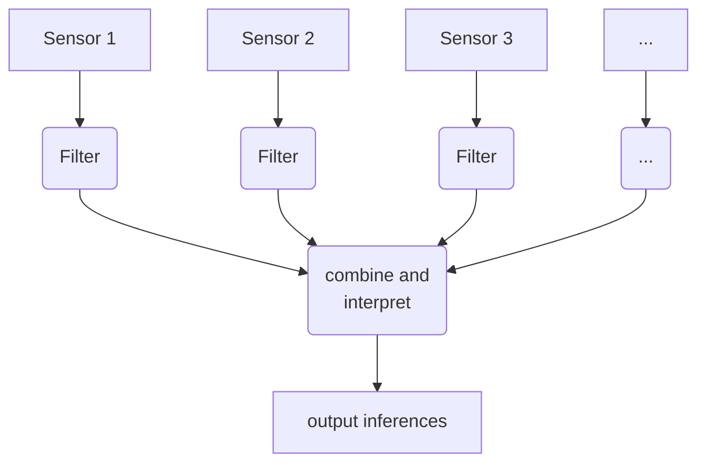
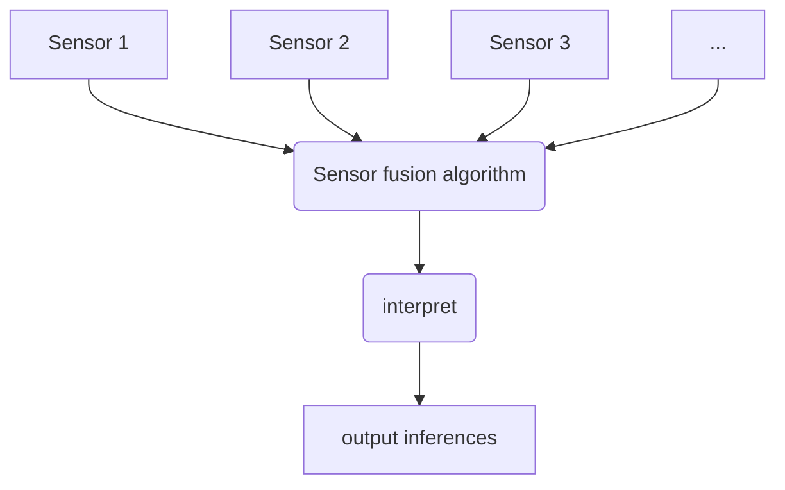
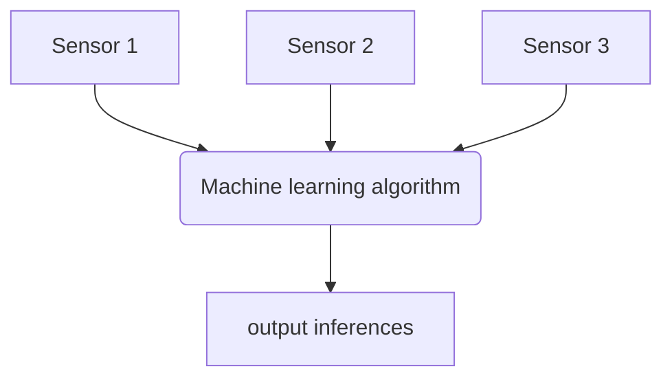

In this section, we discuss a range of ways to combine sensors to make inferences from the combined sensor state. These range from really simple if statements up to a brief discussion of complex machine learning based algorithms.

# A basic algorithm structure
Figure <span class="nextfig"></span> shows a basic algorithm structure which is likely to be what you use in this course. Essentially, we begin by capturing our sensor data. Then, using an understanding of the characteristics of the data as described in Section 3 of this material, we apply the filters from section 4 to clean up the data and make it more usable. Then we can use the methods here to perform interpretation of all the combined, cleaned up sensor data streams.

This is not the only structure possible - in particular you will see many sensor fusion algorithms (mentioned below) combine the steps of filtering individual sensors and combining them into one single step. But for basic processing of sensor data, this is often the way you will do it.

<figure markdown=1>

<figcaption>A typical multi-sensor algorithm structure is to first filter individual sensor data, then interpret all the data streams to create inferences as to the state of whatever we are observing.</figcaption>
</figure>

# If this-then-that

The simplest way of processing data from sensors is to use *if-this-then-that* logic.

In this method, you use basic logical statements to understand whether an event is true, for example:

> If a motion sensor fires then no sound or motion is sensed in the minute after, then a person has left the room.

We can also represent these as flowcharts, e.g. Figure <span class="nextfig"></span> shows an example of a motion and sound sensing system which uses a motion sensor by a door to try and detect whether there is anyone in the room, and whether a person triggering the door motion sensor is leaving or entering the room.

<figure markdown=1>

<figcaption>If-this-then-that logic to understand whether someone has entered or left a room based on sound and motion sensing.</figcaption>
</figure>

# Combined Thresholding

Combined thresholding extends the thresholding approaches we saw in the section on filtering to multiple sensors. This is where we use thresholds that are dependent on more than one sensor. The code below shows an example, where we have two sensors; if either are greater than some threshold, we count that as strong evidence that there is an event; if both sensors are greater than some lower threshold, we also consider this as sufficient evidence for an event.

```python
if sensor1>600:
    threshold=1
elif sensor2>500:
    threshold=1
elif sensor1>400 and sensor2>300:
    threshold=1
else:
    threshold=0
```

We can also apply mathematical combinations of sensor values and then threshold these. For example the code below takes a weighted average of two sensors and applies a simple threshold to that. This makes sensor1 relatively more important than sensor2 to the combined threshold.

```python
if sensor1*.7 + sensor2*.3 > 400:
    threshold=1
else:
    threshold=0
```

We can then apply all the same things we would to a normal threshold to these combined thresholds, such as different up and down thresholds, limits on how close events may be detected etc.

# Probabilistic modelling of multi-sensor event probabilities 

If we filter a single sensor to detect whether an event has occurred, we can expect that some of the events fired will be true events, sometimes the sensing will report an event when no event has occurred (false positives), and some true events will not be fired (false-positives). Hopefully most of the time when no event occurs, there is no report of an event (a true negative).
Through testing, we can estimate the relative probability of each type of event given a particular sensor report.

How might we do this? Lets say we run our sensor data and collect data for 100 runs, whilst also collecting *ground truth* data as to whether the event being sensed actually occurred, we can plot them in a *truth table*, which plots filtered sensor output (whether the sensor system says an event occurred) against ground truth values (whether there really was an event). Figure <span class="nextfig"></span> shows what each cell of a truth table means. In our algorithm design we are aiming to increase the percentage of values which fall in the green cells, and decrease the number of events in the red cells. 

<figure markdown=1>
<table class="truthtable">
    <tr>
        <td></td><td colspan=2>Real event</td>
    </tr>
    <tr>
        <th>Sensor report</th><th>True</th><th>False</th>
    </tr>
    <tr>
        <td>True</td><td>True positive</td><td>False positive</td>
    </tr>
    <tr>
        <td>False</td><td>False negative</td><td>True negative</td>
    </tr>
</table>
<figcaption>A truth table shows the number of false positives and false negatives relative to true positives and negatives.</figcaption>
</figure>

However most sensor algorithms are not perfect. What we get in practice if we run a sensing algorithm 100 times will look like Figure <span class="nextfig"></span>.

<figure markdown=1>
<table class="truthtable">
    <tr>
        <td></td><td colspan=2>Real event</td>
    </tr>
    <tr>
        <th>Sensor report</th><th>True</th><th>False</th>
    </tr>
    <tr>
        <td>True</td><td>15</td><td>10</td>
    </tr>
    <tr>
        <td>False</td><td>5</td><td>70</td>
    </tr>
</table>
<figcaption>An example of a truth table result.</figcaption>
</figure>

So, what can we do with this data? We can use it to estimate false positive and false negative rates, or true negative and true positive rates (which are kind of the same thing, in that the false positive percentage is 100 minus the true positive percentage).

We can express these rates in terms of probabilities for an individual sensor like this:
<figure markdown=1>

$$
\begin{array}{ll}
\text{Definitions:}\\
&E =\text{true if real event occurred, false otherwise}\\
&S = \text{true if sensor said an event occurred}\\
&|X| = count of X\\
\\
\text{True positive rate:}\\
& P(S|E) = \frac{|\text{True positives}|}{|\text{True positives}+\text{False positives}|} \\
 \\
\text{True negative rate:}\\
\\
& P(S'|E') = \frac{|\text{True negatives}|}{|\text{True negatives}+\text{False negatives}|} \\
 \\
\text{False positive rate:}\\
&P(S|E') = 1- P(S|E)\\
\\
\text{False negative rate:}\\
&P(S'|E) = 1- P(S'|E')\\
\end{array}
$$
<figcaption>Estimating true positive and negative rates based on observed truth table values.</figcaption>
</figure>

What these figures give you is how accurate the sensor is, in terms of if an event occurs, how likely is it that the sensor picks it up, and if no event occurs, how likely is it that the sensor reports a false positive.

When applying a sensor algorithm in a situation, what we typically want to know is the opposite, if an event is reported by the sensor, how likely is it that this is a real event, i.e. in probabilistic terms what we have is the true positive rate:
$$P(S|E)$$
what we want is the probability that our sensor reporting an event is true, i.e.:
$$P(E|S)$$

We can calculate this using Bayes Theorem ([nice intro here](https://www.mathsisfun.com/data/bayes-theorem.html)) and the fact that the probability of the sensor firing is the sum of the false positive probability and the true positive probability. You can see this in Figure <span class="nextfig"></span>. However, to do this calculation, we need one more value, $$P(E)$$, which is the *base rate* of events occurring, or the probability that in any given  sample, an event will occur. This adjusts for the fact that even if our sensor has a very low false positive rate, if events are also extremely rare, there may still be more false positives than true positives in our observed events.

To estimate a base rate of events ( $$P(E)$$ ), we can either a) use our knowledge of the situation which we are studying to guess how often events occur, or b) use some collected real-world *ground-truth* data to estimate the base rate.


<figure markdown=1>
$$
\begin{align}
P(E|S) &= \frac{P(S|E)P(E)}{P(S)}\\
&\\
       &= \frac{P(S|E)P(E)}{P(S|E)+P(S|E')}\\
\end{align}
$$
<figcaption markdown=1>We can estimate the probability of an event given the sensor firing using Bayes Theorem and an estimated base rate $$P(E)$$ for the event probability.  
</figcaption>
</figure>

## What are these statistics useful for
These statistics allow us to take a sensing algorithm and say what probability of a real event is attached to a particular output of a sensor. Further, if we alter the algorithm by for example changing thresholds and then create another truth table, we can tune the probability to achieve a desired balance between false positives and false negatives, for example we may wish to have the algorithm only fire an event when it is 95% certain that an event occurred.

When we have multiple sensors, extending this maths can allow us to combine sensors and make inferences as to the respective probabilities of events based on the output of multiple sensors. Figure <span class="nextfig"></span> shows this worked out for the four possible combinations of values of 2 boolean (true/false) sensors $$S_1$$ and $$S_2$$. This extension basically just treats the 2 combined true/false sensor values as being 4 possible values of a single variable. It can be extended to an arbitrary number of sensors similarly, although the truth tables become exponentially large as the number of sensors increases.


<figure markdown=1>

$$
\begin{align}
P(E|S_1 \land S_2) =&\frac{P(S_1 \land S_2|E)P(E)}{P(S_1 \land S_2)}\\
Where:\\
P(S_1 \land S_2|E) =&\text{Proportion of events in testing sample}\\
& \text{where both sensors fired}.\\
& \rule{10cm}{1pt}\\

P(E|S_1 \land S_2') =&\frac{P(S_1 \land S_2'|E)P(E)}{P(S_1 \land S_2')}\\
Where:\\
P(S_1 \land S_2'|E) =&\text{Proportion of events in testing sample}\\
& \text{where sensor 1 fired but sensor 2 did not}.\\

...
\end{align}
$$

<figcaption markdown=1>To estimate probabilities based on multiple true/false sensor outputs, we can treat them as one big sensor with $$2^n$$ possible values.
</figcaption>
</figure>

What this means is that we can combine our 2 or more sensor outputs and have a good idea of what the probability of a real event is based on what the reported value of each sensor is. This is useful because we can then set different responses in our system based on the observed event probability. Let us think a bit about that with the question below:

<details class="question" markdown=1>
<summary>
Imagine we have a burglar alarm protecting some extremely valuable property (e.g. the crown jewels, Fort Knox, my lunchbox at 11:55am...). It uses two sensors to estimate the probability of an intruder in the building. The estimated probability of an intruder based on the sensor readings is one of &lt;1%, 30%, 70%, 100%. What actions might we take based on these sensor readings?
</summary>
When I considered this, I though that maybe they have 3 levels of action to take (in addition to doing nothing), they could a)just look at the CCTV where the sensor is triggered, b)they could send security to go and check, and c) in extreme cases, they might directly alert the police. These might be applied like so:

|Probability| Action |
|--|--|
|&lt;1%|Do nothing|
|30%| Look on CCTV |
|70%| Send a security team to check the building|
|100%| Send a security team and call the police |

</details>

# Sensor Fusion

Mathematical sensor fusion approaches allow us to combine multiple numerical sensors to estimate the value of some underlying physical process. This can then be used either as an output to our algorithm (if our algorithm aims to measure some value), or interpreted to fire events. 

What is different about sensor fusion algorithms as opposed to previously described algorithms is that they combine the filtering of all sensors into a single step, so our algorithm structure becomes more like Figure <span class="nextfig"></span>. This makes them extremely powerful as they are able to represent a wide range of co-dependencies between the sensors and the output value. 

<figure markdown=1>

<figcaption>Mathematical sensor fusion algorithms combine sensors in one step, including filtering the raw data.</figcaption>
</figure>

These algorithms require a bit of slightly complex maths, and as such are outside the general scope of this course, but I'll put some useful links here about a couple of algorithms you might want to play with if you're super keen and have a maths background. For an absolute bible on this stuff, check out this online book with python examples:

[Kalman & Bayesian filters in Python by Roger Labbe](https://mybinder.org/v2/gh/rlabbe/Kalman-and-Bayesian-Filters-in-Python/master)

## Kalman Filter

The Kalman Filter is a mathematical filter which models how a sensor responds to an underlying process value in terms of gaussians. It uses an internal state which represents the current estimated state of the sensed process. At each step in time, it first does a *prediction* stage, which updates the internal state based on how it is likely to change over time (for example if our state includes velocity and position, the position at the next state will be increased by velocity\*timestep), then it performs an *update* stage, which updates the estimate of state based on the current sensor readings. In a kalman filter, all estimates of error are stored as simple gaussians, and all process updates are simple linear transformations of the predicted gaussians. This means that it can be performed on systems with low memory and processor resources. For details of how kalman filtering works and the maths, look at the links below.

[A useful intro to kalman filters](https://www.intechopen.com/books/introduction-and-implementations-of-the-kalman-filter/introduction-to-kalman-filter-and-its-applications)

[Some basic kalman filtering in python](https://medium.com/@jaems33/understanding-kalman-filters-with-python-2310e87b8f48)

## Particle filtering

The kalman filter is a linear filter which models error as being gaussian. These assumptions mean that it is limited in its use when applied to the many real-world systems which do not behave in ways that are linear or are impractical to transform into a linear representation. The particle filter is designed to solve these issues; instead of representing the current estimated state and error of the sensed process as a gaussian, it is modelled as a large set of 'particles', each of which models one possible state of the sensed process. Each particle is updated each time step by first updating based on understandings of the process (e.g. move position by velocity as described above); then each particle is scored against sensor measurements to estimate the probability that this particle is correct based on the observed sensor measurements. Finally, a new set of particles is generated for the next time step which is based on randomly sampling the existing particles, but weighting the sampling based on the estimated probabilities. Over time this tends to converge on the correct value quite well.

The particles in this filter mean that it can represent complex multi-modal distributions, processes that are non-linear, and it has a wide level of flexibility. However the need to keep track of all the particles for every time step means that it has higher memory and processor requirements than a Kalman filter.

[An article describing particle filtering](https://towardsdatascience.com/particle-filter-a-hero-in-the-world-of-non-linearity-and-non-gaussian-6d8947f4a3dc)

# Machine Learning

Machine learning describes a range of approaches to sensor filtering which are currently the state-of-the-art. Machine learning approaches typically take a set of input sensor values and apply some kind of *learnt* function to them which transforms them into inferences about the state of the world. Machine learning provides yet another algorithm structure (Figure <span class="nextfig"></span>), where inferences can be directly generated based on input data.

<figure markdown=1>

<figcaption>Machine learning can go from data directly to inferences.</figcaption>
</figure>

Modrern machine learning algorithms are primarily constructed by simple combinations of matrix multiplications of input and intermediate data with fixed *weight* matrices, arranged in multiple *layers*, plus the application of a small number of simple non-linear functions to allow them to represent non-linear mappings between input and output. What makes them powerful is firstly the size of the matrices being used, which enables very complex functions to be represented, and secondly the ways of calculating the weight matrices which define what function is being performed.

The construction of weight matrices is complex and beyond the scope of this course (see the machine learning course for more on the practical details), so we will just very briefly describe it here. The most common way of constructing them is through *supervised learning*, where a function is tested against a large *training* dataset, where we know both the sensor inputs, plus the expected output values, and then a form of gradient descent is used to make the function better at transforming the input values to the correct output values. As several iterations are done over the training dataset, the algorithm becomes increasingly better at transforming inputs to the correct outputs. 

The advantages of this kind of machine learning approach is that it can often be extremely powerful in representing very complex systems, without requiring a software developer to do specific modelling of that system. However, most approaches to machine learning do come with a cost, which is the need to gather large amounts of training data, which consists of the input data, along with *ground truth* data which describes the expected output for each input data point. If this ground truth data is not available or data is expensive to collect, it can make creating a machine learning based sensor system difficult or impossible.

For a really quick run through a load of machine learning examples, have a look here:
[Tensorflow & Keras deep learning tutorial](https://machinelearningmastery.com/tensorflow-tutorial-deep-learning-with-tf-keras/)
