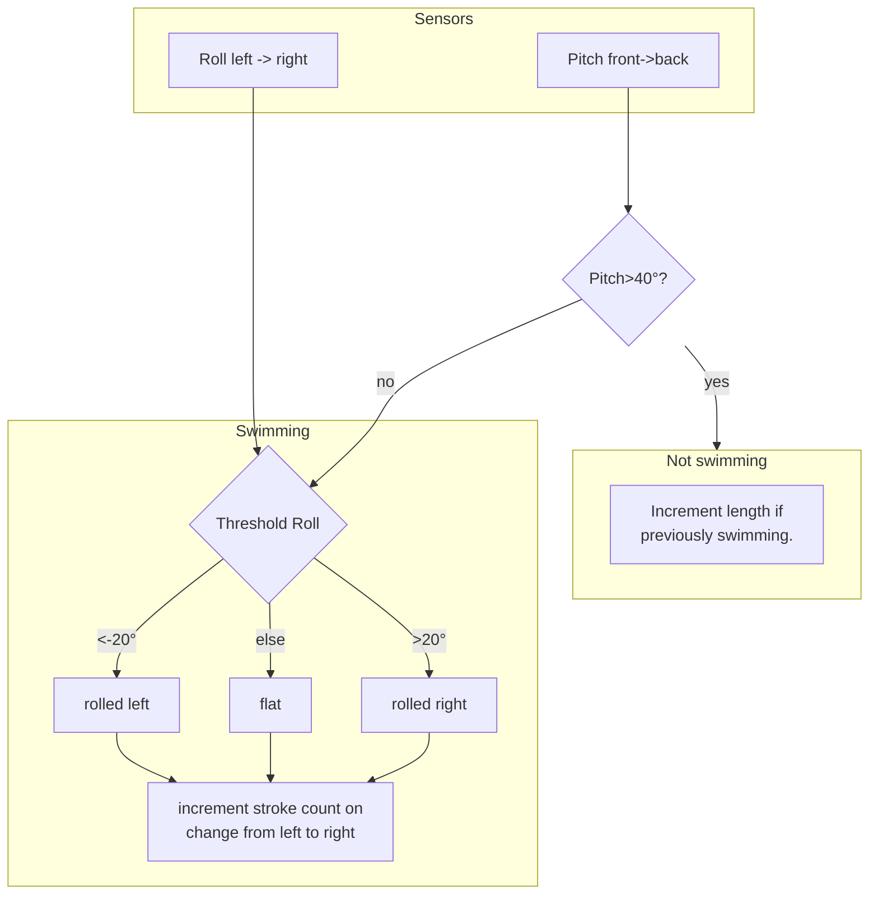

On this page I present a set of example sensing systems which I have built in the past, so you can see how sensor data is combined to make inferences in these systems.

# Swim Stroke Sensing

I built a project which sensed how someone was swimming, what stroke they were doing, and counted strokes they did and them turning at the end of lengths. 

This was done by using an accelerometer mounted on the back of the swimmer to detect pitch & roll of the swimmer, which is then used to estimate stroke count and turning.

The code below uses smartphone accelerometer to do a simplified front-crawl only version of the stroke sensing algorithm. How the algorithm works for front crawl is that it detects a rolling motion of the body as each arm pulls and uses forward-back rotation of the body to detect turning and stopping. The sensor data is processed using thresholds and a simple if-this-then-that approach, which is described by the flowchart below.

<figure markdown=1>

<figcaption>A simple swim stroke counting algorithm using if-this-then-that logic</figcaption>
</figure>

The code below implements this using your smartphone accelerometer. Have a play and see it in action. You have to imagine it was strapped to the back of your body.

<script>
makePyodideBox({
    codeString:
`SAMPLE_TIME = 0.01 # sample 100 times a second

ROLL_MEDIAN_COUNT=10 # bit of smoothing on roll
PITCH_MEDIAN_COUNT=20 # lots of smoothing on pitch

import graphs,sensors,time,filters
import math
graphs.set_style("pitch (forward/backwards)","rgb(0,0,0)",-5,5)
graphs.set_style("roll (left/right)","rgb(255,0,0)",-5,5,subgraph_y=1)

# startup delay 
time.sleep(.5)

# constant to convert from degrees to radians
DEGREES_TO_RADIANS=math.pi/180.0


# whether we last tilted left (-1) or right (1), or 
# unknown (0)
current_tilt=0
# are we swimming right now?
currently_swimming=False

pitch_filter=filters.MedianFilter(PITCH_MEDIAN_COUNT)
roll_filter=filters.MedianFilter(ROLL_MEDIAN_COUNT)

length_count=0
stroke_count=0
while True:
    x,y,z=sensors.accel.get_xyz()
    # calculate left/right roll (in radians)
    roll_raw=math.atan2(x,z)
    # smooth roll with median filter
    roll=roll_filter.on_value(roll_raw)
    # calculate forward/backward pitch (in radians)
    pitch_raw=math.atan2(y,z)
    # smooth pitch with median filter
    pitch=pitch_filter.on_value(pitch_raw)
    if abs(pitch)<40*DEGREES_TO_RADIANS:
        if not currently_swimming:
            # we are starting to swim
            current_tilt=0
            stroke_count=0
            currently_swimming=True
            print("Swimming")
    else:
        if currently_swimming:
            print("Stopped")
            # stopped or turning at end of a length
            current_tilt=0
            length_count+=1
            print("Length:",length_count,"strokes:",stroke_count)
            currently_swimming=False
    if currently_swimming:
        # sense strokes
        if roll<-20*DEGREES_TO_RADIANS:
            # tilted left
            # if previously tilted right, add a stroke
            if current_tilt==1:
                stroke_count+=1
                print("STROKE")
            current_tilt=-1
        elif roll>-20*DEGREES_TO_RADIANS:
            # tilted right
            # if previously tilted left, add a stroke
            if current_tilt==-1:
                stroke_count+=1
                print("STROKE")
            current_tilt=1
    graphs.on_value("pitch (forward/backwards)",pitch)
    graphs.on_value("roll (left/right)",roll)
    time.sleep(SAMPLE_TIME)
`  ,hasConsole:true,hasGraph:true,showCode:true,editable:true,caption:"Example of front-crawl stroke detection - try holding the phone flat to 'swim' and tilting it left and right for each stroke, then bringing it upright to stop at the end of a length"})
</script>

# Touchomatic Single Player Rejection

In another project with my colleague Paul Tennent, I built Touchomatic a game driven by touch between two people. Players hold one hand on a game handle each, and with the other hand they touch the other player's hand. How hard the two people touch is used to drive a simple game engine. The sensing in this game is controlled by an Arduino, which enables resistive sensing between the two player handles, along with capacitive sensing on each player handle. The resistive sensing allows the detection of how hard people are touching each other, whilst the capacitive sensing allows us to detect if a person is holding each handle (see Figure <span class="nextfig"></span> for a system diagram).



The system is designed for use by two players, and the fun of the game is about the interaction between these two players. However when we first put it out to be played, some people came up to the machine and tried to play it with one hand on each controller handle. It worked badly like this, so we decided that we needed to reject these single players, and enforce two player gaming.

We did this using the existing sensing, by creating a situation which was impossible to replicate with a single player. I've set this as a puzzle below, click to see the answer once you've had a bit of a think.

<details class="question" markdown=1>
<summary markdown=1>
A puzzle for you:

We had capacitive sensing which could reliably answer the question 'is a player holding handle 1' and 'is a player holding handle 2'. We also had resistive sensing which could answer the question 'Is there a circuit between the hand on handle 1 and the hand on handle 2'. We thresholded everything to give us true or false values for each of the 3 sensor values. 

Consider all 8 possible values of the 3 sensors as listed below. Which one of these combinations is impossible to create with a single person?


| Hand on left handle | Hand on right handle | Circuit between handles |
|---|---|---|
|False|False|False|
|False|False|True|
|False|True|False|
|False|True|True|
|True|False|False|
|True|False|True|
|True|True|False|
|True|True|True|

</summary>

## Answer

If you said 'True,True,False', you would be correct. If a single person touches the left handle and the right handle, there is also a circuit between the two handles. Whereas with two people, they can each be touching a handle but not touching each other. 

In the real game, we make people hold a handle each, then high-five each other to start the game. This means that only two players can start playing the game, because at the point just before they high-five, their hands are apart, making the true,true,false combination of sensor values.
</details>

The logic behind the single player rejection algorithm is super simple, using a combination of thresholds and if-this-then-that logic, along with a counter used to make sure that we see sensor values consistent with 2 players for 10 frames or more so that single players can't get into the game due to noise in the sensing causing unexpected values.

```python
# We wait until we have seen 
# sensor values consistent with 2
# players for 10 frames.
twoPersonCounter=0

def processSensorData(leftCapacitive,rightCapacitive,resistance):
    # threshold both capacitive sensors to check
    # that they are being touched
    if leftCapacitive>100 and rightCapacitive>100:
        # if resistance is less than 100, 
        # there is no circuit
        if resistance<100:
            # this state can only be reached 
            # with two people
            twoPersonCounter+=2 
    twoPersonCounter=twoPersonCounter-1
    if twoPersonCounter<0:
        twoPersonCounter=0
    if twoPersonCounter>10:
        print("FOUND TWO PEOPLE")  
```

If you're interested, you can [read more about this project here](http://www.cs.nott.ac.uk/~pszjm2/projects/Interpersonal_Touch/Touchomatic__Interpersonal_Touch_Gaming_In_The_Wild.html)


# Swing Angle Detection

In another project, we had a swing, which was used in a VR experience driven by user's swinging. We wanted to know where people were on the swing at any given point, which meant we needed to sense the angle of the swing.

Initially, we did this the obvious way, by putting a gyroscope and accelerometer on the seat of the swing, and sending data from that to the headset to drive the VR experience. That worked great, but involved wireless networks and all sorts of shenanigans to make the seat sensors connect to the swing headsets. So we thought what might be a good idea would be if we could estimate swing angle entirely through the built in accelerometer in the headset. With that in mind, we set the VR experience to capture accelerometer data and save it alongside recorded data from the swing angle sensor. We then ran this with 10,000 participants (it was an art thing that toured to several venues) and collected swing angle data along with accelerometry.

With this large dataset or accelerometer data along with ground truth swing angle data points, we were able to train a machine learning model to estimate the swing angle accurately, thus allowing us to drive the VR experience entirely off the headset, thus removing the requirement for a seat sensor and thus removing the need for wireless networking at all. 

For anyone interested in machine learning who talks Keras, the (very small) neural network we used for it is shown in Figure <span class="nextfig"></span>. Don't worry if you don't understand this figure as it isn't important at all, just included for interest.

If you're interested in the project itself, there you can [read more about the swing here](
http://www.cs.nott.ac.uk/~pszjm2/publications/The_Challenge_of_Visual_Kinaesthetic_Experiences.html)

<figure markdown=1>
```python
from keras import layers as kl
from keras import backend as K
from keras.models import Sequential

num_conv_layers=4
conv_size=4
conv_kernels=8
conv_stride=2
gru_neurons=8
dropout_level=0.2

model = Sequential()
# the model takes an input which is a history buffer 
# with the 3 accelerometer axes for each of lookback
# data points
model.add(kl.InputLayer(input_shape=(self.lookback,
self.features),batch_size=self.batch_size)) 
# the model has 4 convolution layers
for c in range(num_conv_layers):        
    model.add(kl.Conv1D(conv_kernels,conv_size,
    strides=conv_stride,padding='same',activation="relu"))
    model.add(kl.Dropout(dropout_level))
# followed by a GRU layer
model.add(kl.CuDNNGRU(gru_neurons,return_sequences=True))
# dropout is used to avoid model overfitting
model.add(kl.Dropout(dropout_level))              
model.add(kl.CuDNNGRU(gru_neurons))
model.add(kl.Dropout(dropout_level))              
# the tanh activation limits the output
# to between -1 and 1
model.add(kl.Dense(1,activation='tanh'))
# and this converts it to degrees between -90 and 90
model.add(kl.Lambda(lambda x:x*90,output_shape=(1,)))
```
<figcaption>The model definition for the swing sensor model</figcaption>
</figure>

