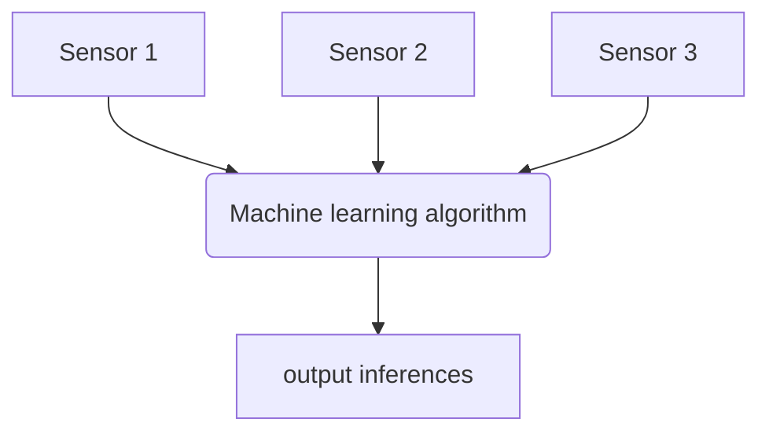

Machine learning techniques are ways of using computers both to perform the task of sensor data interpretation, but in addition to automatically 'learn' how to interpret the data in the way which you want to. 

What this means is that rather than all the processes of capturing sensor data, analysing it, hand-crafting and tuning a sensor algorithm to interpret the data in the way which you want, one can give the machine learning algorithm some data and it will learn how to correctly interpret that data, and automatically output the interpretations you want.

<figure markdown=1>

<figcaption>Machine learning can go direct from sensor data to outputs.</figcaption>
</figure>

However, there is a catch - in most machine learning approaches, we use what is called supervised learning. This uses labelled training data, where the training data both has raw sensor data, along with ground truth data as to what the model is expect to output for each data point. Capturing this ground truth data (or labelling data points after the fact) is not always easy, and we typically need a large amount of it to train machine learning models to work effectively.

Supervised learning approaches use complex models and apply an optimisation process to the model parameters which goes through batches of data and alters the parameters so that the model outputs better results. After several passes over the data (epochs), the model output will hopefully become close to the expected ground truth. In the most common forms of machine learning this is essentially a form of gradient descent over set of large matrix multiplications and simple non-linear 'activation' operations. These operations allow the machine learning model to match a wide range of possible mappings between input and output.

Interestingly, the use of machine learning models in many fields (most notably computer vision) has demonstrated that not only can these models perform extremely well at interpreting complex patterns in data, in fact they can often perform significantly better than hand coded data processing.

<figure markdown=1>

|  | Comparison |
|--------|:-----------------------------|
| Training data | Machine learning requires large amounts of labelled training data in a way that hand-coded algorithms do not. |
| Accuracy | Machine learning models often achieve greater accuracy compared to hand-coded models. |
| Performance | Machine learning usually requires more processor power for inference than simpler hand-coded models. A lot of processor power is required for training of machine learning models.|
| Sensor data| Machine learning is very good at performing inferences using poor quality data, such as that from simpler sensors or sampled using lower data rates. This can reduce power requirements or system cost. |
| Training | Training and tuning of machine learning algorithms is typically done offline, on systems with high powered processors and graphics cards or specialised machine learning accelerator chips.
| Clarity | The behaviour of hand-coded algorithms is typically clear to the developer, and can be explained to users. Many machine learning algorithms are opaque and give little information as to why they work and how.|

<figcaption>Machine learning and hand-coded algorithms compared.</figcaption>
</figure>

# Some tutorials on machine learning

For a really quick run through a load of machine learning examples, have a look here:
[Tensorflow & Keras deep learning tutorial](https://machinelearningmastery.com/tensorflow-tutorial-deep-learning-with-tf-keras/)

Or for a more in depth online course 
[Google tensorflow crash course](https://developers.google.com/machine-learning/crash-course/)
