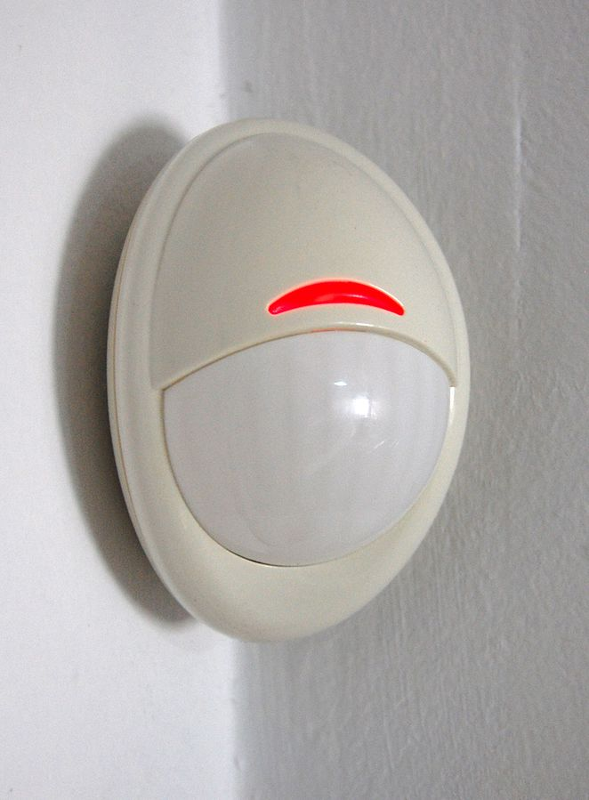
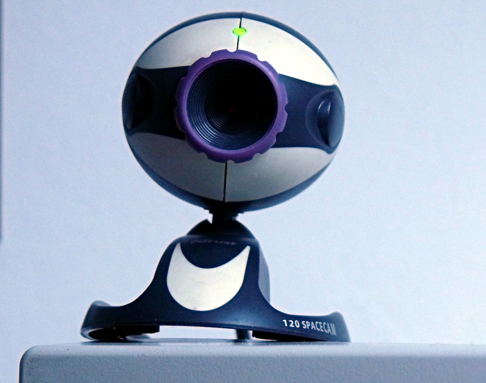

## Examples of sensors

This is a sensor

This is also a sensor

This is a sensor

This is also a sensor

So. What is a sensor? What does it do....

Take a pause to think about that before you click to the next page which has the answer on it!
