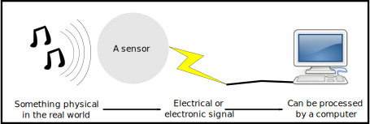

## Definition

A sensor is: 
> "a device which provides a usable output in response to a specific measurand" [Instrument Society of America, 1975](#isa). 

> A device that receives a stimulus and responds with an electrical signal [McGrath & Scanaill 2014](#mands)

So basically, it is something that takes some kind of physical thing that is happening in the real world, and creates an electrical output which alters based on that physical change.

## Sensor examples revisited

How does this apply to my examples of sensors?

A passive infrared motion sensor responds to the level of emitted infrared light coming into the sensor. By detecting changes in the amount of light across the sensor it is possible to detect motion of warm objects such as humans or animals.

A microphone creates electricity based on vibrations of a membrane inside the microphone. Because this responds to the vibrations in the air, the microphone responds to air vibrations or sound waves and outputs a corresponding electrical signal.

A keyboard is a set of buttons, each of which respond to a physical pushing action by outputting an electrical signal based on whether the button is pushed down or not.

A camera contains a grid of sensors which respond to photons (light) falling on them. By placing this grid of sensors behind a lens and counting how much light hits each sensor in the grid, we can capture an image from the camera.

## Further reading

To understand more about the nature of sensors and sensing, there is a really useful book chapter linked below by McGrath & Scanaill [2014](#mands) which is absolutely worth a read. Maybe take a look after you've done the next "what is a sensor" exercise.

## References

1.  Instrument Society of America/ ANSI, “ISA S37.1–1975 (R1982),” ed, 1975. N.b. you don't need to read this reference unless you have an absolutely masochistic desire to find and read standards documents, read the book below instead. 

1. McGrath M.J., Scanaill C.N. (2013) Sensing and Sensor Fundamentals. In: Sensor Technologies. Apress, Berkeley, CA. [https://doi.org/10.1007/978-1-4302-6014-1_2](https://doi.org/10.1007/978-1-4302-6014-1_2)
